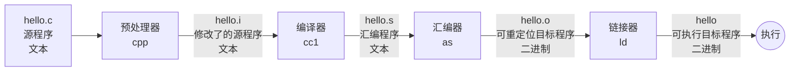

<h1 align="center">Missing Semester DynamicX 第二课 </h1>
一、程序编译的基本流程

```mermaid
graph LR
    A[hello.c<br>源程序<br>文本] --> B[预处理器<br>cpp]
    B -->|hello.i<br>修改了的源程序<br>文本| C[编译器<br>cc1]
    C -->|hello.s<br>汇编程序<br>文本| D[汇编器<br>as]
    D -->|hello.o<br>可重定位目标程序<br>二进制| E[链接器<br>ld]
    E -->|hello<br>可执行目标程序<br>二进制| F((执行))
```
